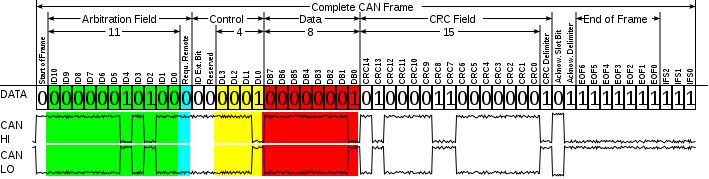

# Nissan Sentra 2010 CAN bus data

## CAN bus frame

Note that when referring to recorded data bytes in a CAN message payload, bytes are numbered left-to-right with index 1 as I saw them on screen.
Bits referenced are numbered right-to-left in [zero-order](https://en.wikipedia.org/wiki/Zero-based_numbering) with 8 bits per byte.
For instances where the data length code (DLC) is not 8 bytes, the DLC is specified.

## Inputs to reverse engineer

A preliminary list of human vehicle controls to sniff the CAN bus for

* Accelorator pedal
* Brake pedal
* Steering wheel angle
* Vehicle headlights
* Windshield wiper controls
* Turn signals
* Hazard lights
* Cruise control
* Horn
* Climate control
* Rear window defrost
* Doors open
* Seat belts
* Parking brake
* Radio buttons
* Power windows
* Power door locks
* Power side mirrors
* Cabin lights
* Gas cap release
* Trunk release

## Setup

Physically connected to vehicle's OBD-II port using a [Kvaser Leaf Light HS v2](https://www.kvaser.com/product/kvaser-leaf-light-hs-v2/) CAN interface.
This CAN interface is connected via USB to a laptop running Linux.
Using the [SocketCAN](https://en.wikipedia.org/wiki/SocketCAN) driver to create a network interface (arbitrarily named "can0").

Discovered via trial and error that the CAN bus bit rate on the Nissan Sentra is 500kbit/s.
The the majority of passenger vehicles will use a CAN bus bit rate of either 250kbit/s or 500kbit/s.

Configuring the CAN network interface

1. `sudo ip link set can0 type can bitrate 500000`
1. `sudo ip link set can0 up`

Using the [can-utils](https://github.com/linux-can/can-utils) package; specifically `cansniffer` to see changes and `canbusload` to monitor bus load.

Arguments used

* `cansniffer -c can0`
* `canbusload -tcbr can0@500000`

All recorded CAN message IDs are in hexadecimal.

## Active CAN IDs

### Key inserted, ACC off, engine off

CAN bus load 7%

When key inserted or removed, messages from the following IDs only last a few seconds then stop sending

* 358
* 35D
* 625

When key moved to first position (before ACC), messages from the following IDs are seen periodically and constantly

* 35D
* **60D**
* 625

When vehicle is off (no key inserted at all) and a control is activated (one that is allowed to be used when the vehicle is off; eg. door open, hazard & head lights) messages with the following IDs are seen in addition to the usual ones associated with said control

* 35D
  * data byte 2, bits 0-1 => 0b00=doors closed, 0b11=driver door opened
* 625
  * DLC=6
  * data byte 4, bits 0-1 => 0b10=doors closed, 0b01=any door opened

### ACC on, engine off

CAN bus load 30%

Messages from the following IDs always actively changing

* 174
  * data byte 5 => cycles through values 01 04 05 09 0C 0D
* 176
  * DLC=7
  * data byte 7 => cycles through values 01 05 06 09 0D
* 180
* 182
* 280
* 284
* 285
* 551
  * data byte 1, bits 0-1  => cycles through values 0b01 0b10
* 560
  * DLC=3
* 6E2
  * DLC=3
  * data byte 3 => cycles through values 78 7A and 7B 79

### Engine running

CAN bus load 30%

Messages from the following IDs always actively changing.
Bolded IDs are newly seen relative to when ACC on.

* **160**
* 174
* 176
* 180
* 182
* **1F9**
* 280
* 284
* 285
* 551
* 560
* 6E2

### Vehicle controls

#### Accelorator pedal

* 160
  * bytes 5-8 => seem to correspond to pedal position
  * bytes 1-2 => 3D64 when pedal not pressed, increases to 41D4 when fully pressed
  * byte 3 => always A1

#### Brake pedal

* 354
  * byte 7, bit 4 => 0=not pressed, 1=pressed
* 35D
  * byte 5, bit 4 => 0=not pressed, 1=pressed

#### Steering wheel angle

No change in messages

Only tried with ACC on, engine off

#### Vehicle lights

Forward facing lights

Possible states are: off, headlights on, fog lights on, high beams on

* 358
  * byte 2, bit 7 => 0=off, 1=any light on
* 60D
  * byte 1, bits 1-2  => 0b00=off, 0b10=headlights on, 0b11=fog lights on
* 60D
  * byte 2, bit 3 => 0=high beams off, 1=high beams on
* 625
  * DLC=6
  * byte 2, bits 4-6 => 0b000=off, 0b100=headlights on, 0b110=fog lights on, 0b001=high beams on

When car is off (no key inserted)

* 5C5
  * byte 1, bits 6-7 => 0b10=off, 0b01=any light on

#### Windshield wipers
 
Wiper control stick

Possible states are: off, oneshot ("MIST"), intermittent ("INT"), slow ("LO"), fast ("HI")

* 35D
  * byte 3, bits 5-7 => 0b000=off, 0b110=oneshot, 0b010=intermittent, 0b110=slow, 0b111=fast
  * Bits for oneshot and slow settings are the same
* 354
  * appears during intermittent wiper setting
  * byte 5, bit 1 => 0=off, 1=intermittent, ...
* 625
  * byte 1, bits 1-2 => 0b01=off, 0b10=intermittent, ...

#### Turn signals

Turn signal control stick

Data bytes change each time turn signal ticks/lights up

* 60D
  * byte 2, bits 5-6 => 0b00=off tick, 0b01=left turn tick, 0b10=right turn tick

#### Hazard lights

Data bytes change each time lights are flashed on and off

* 60D
  * byte 2, bits 5-6 => 0b00=off, 0b11=blink on

This is really just a combination of both the left and right turn signal lights.
Same bits seen when using turn signal control stick.

#### Cruise control

Cruise control on/off button on steering wheel

* 551
  * byte 6, bits 4-6 => 0b000=off, 0b101=on

Did not test setting cruise control speed or increasing/reducing speed setting, this would require the vehicle to be moving (minimum 40 km/h before cruise control can be active)

#### Horn

No change in messages

#### Climate control fan

* 358
  * byte 2, bit 6 => 0=off, 1=fan on (any speed)
* 35D
  * byte 1, bit 0 => 0=off, 1=fan on (any speed)

No other climate control setting showed any change in messages

#### Rear defrost

Rear window defrost on/off button

* 35D
  * byte 1, bits 1-2 => 0b00=off, 0b11=on

#### Door ajar

* 60D
  * byte 1, bits 3-6
    * bit 3    driver side front door => 0=closed, 1=open
    * bit 4 passenger side front door => 0=closed, 1=open
    * bit 5    driver side rear  door => 0=closed, 1=open
    * bit 6 passenger side rear  door => 0=closed, 1=open

#### Seat belt

When seat belt is clicked in for the driver

* 280
  * byte 1, bit 1 => 0=clicked in, 1=not clicked in

Most likely for enabling the seat belt indicator light on the dash

Also tried passenger seat belt but saw no change in messages

#### Parking brake

* 5C5
  * byte 1, bit 2 => 0=off, 1=parking brake engaged

#### Radio buttons

No change in messages

Unlikely to be on the same bus as the rest of the vehicle controls

#### Power windows

No change in messages

Tried lowering and raising all four windows

#### Power door locks

No change in messages

Tried locking and unlocking all four doors

#### Power side mirrors

No change in messages

Tried adjusting both left and right side mirrors

#### Cabin lights

No change in messages

Tried turning on front cabin light and back seat cabin light

#### Gas cap release

No change in messages

Likely just a mechanical release

#### Trunk release

No change in messages

Likely just a mechanical release

## CAN ID summary

CAN message IDs to control relations identified but not limited to

| ID | Control |
| -- | ------- |
| 160 | Accelorator pedal |
| 280 | Seat belt |
| 354 | Brake, wipers |
| 358 | Headlights, climate control |
| 35D | Brake, wipers, climate control, rear defrost |
| 551 | Cruise control |
| 5C5 | Headlights (car off), parking brake |
| 60D | Headlights, turn signals, doors |
| 625 | Headlights, wipers |
